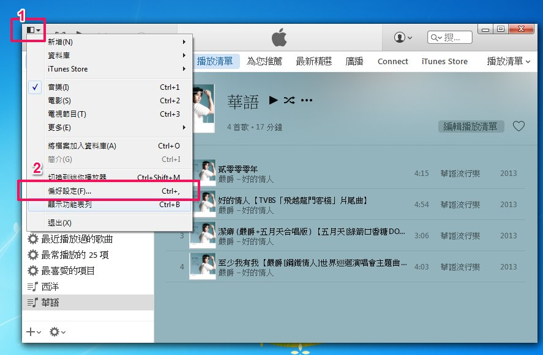
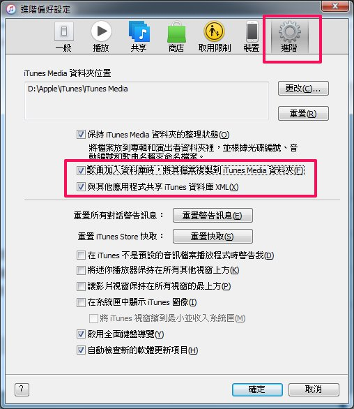
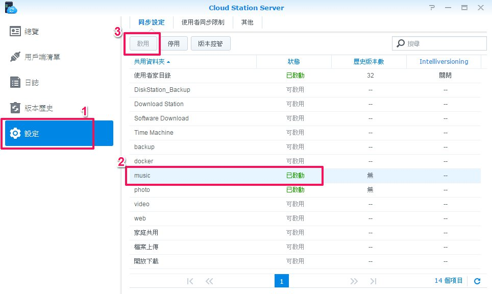
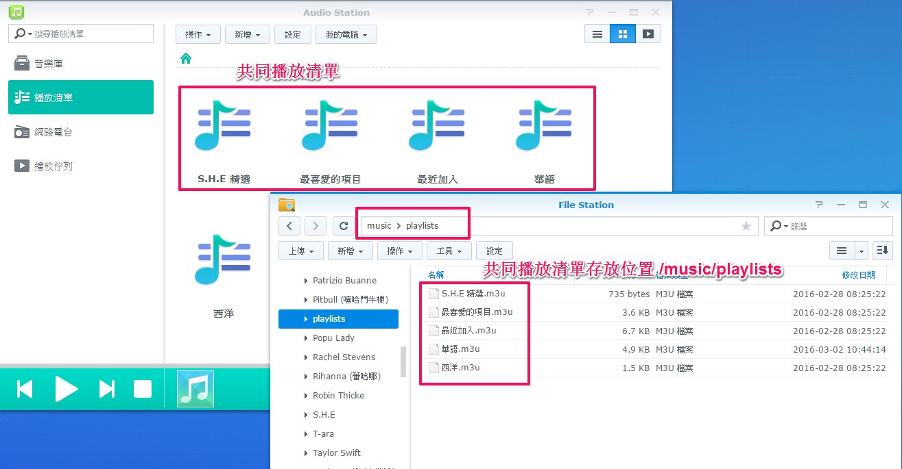
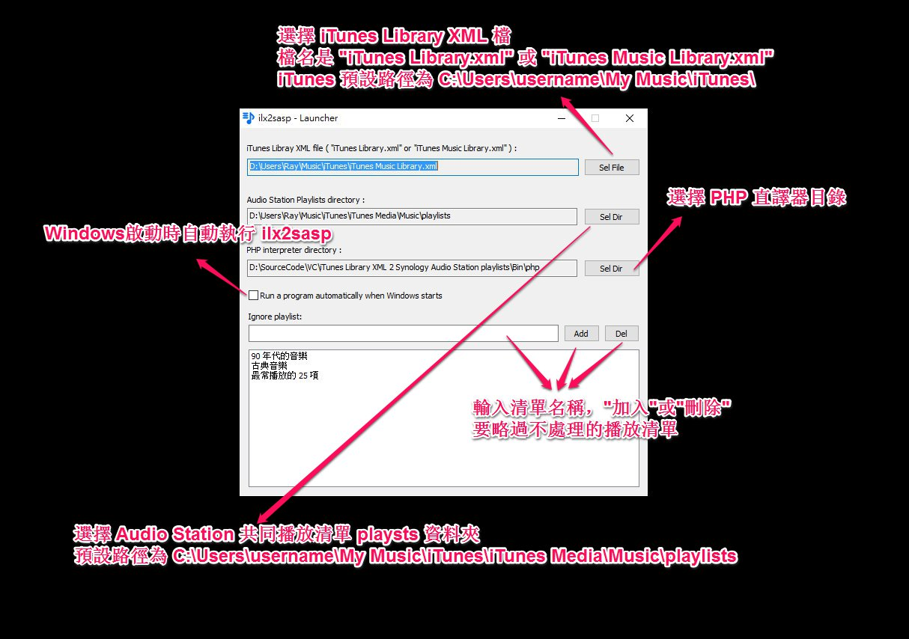

# ilx2sasp

iTunes Library XML 2 Synology Audio Station Playlists

 最後更新: 2016/08/28 

### 主要功能：

ilx2sasp 是 Windows 的一個小工具程式，主要用來將 iTunes playlists 轉成 Synology audio station playlists。

### 說明：

個人習慣在電腦上使用 iTunes 整理音樂，在手機使用 Synology Audio Station (DS Audio) 播放音樂，ilx2sasp 是我寫的小程式，可以單向同步 (iTunes -> Audio Station) 音樂播放清單，ilx2sasp 執行後會長駐在系統通知區域，只要 iTunes 播放清單有變更，ilx2sasp 就會自動更新 Audio Station 的播放清單。

這裏說明一下 ilx2sasp 的工作方式，ilx2sasp 只是單純去解析 iTunes Library XML 中的播放清單，將其轉成 Aduio Station 的播放列表格式 (*.m3u) 並儲存在 playlists 資料夾，再利用 Cloud Station 的同步功能， 將音樂檔案與播放列表同步到 NAS Audio Station。

### 在使用程式前確認下列都已安裝：

1. DSM 套件，Audio Station 與 Cloud Station Server 。
2. Clinet 端同步軟體 Cloud Station / Drive  。
3. Apple iTunes 軟體。

啟動 iTunes 偏好設定 -> 進階 -> 勾選 “歌曲加入資料庫時，將其檔案複製到 iTunes Media 資料夾” 與 “與其它應用程式共享 iTunes 資料庫“。

iTunes 預設的資料庫位置為：`C:\Users\username\My Music\iTunes\`

而 mp3 等音樂檔案位置為：`C:\Users\username\My Music\iTunes\iTunes Media\Music\`

“與其它應用程式共享 iTunes 資料庫” 勾選後，iTunes 會在 `C:\Users\username\My Music\iTunes\` 產生一個名為 “`iTunes Music Library.xml`” 或 “`iTunes Library.xml`” 的檔案，ilx2sasp 執行需要這個 xml 檔。

### 同步 iTunes 與 Audio Station 音樂檔案 

在 DSM 開啟 Cloud Station Server，確認 Audio Station 使用的共用資料夾 music 同步狀態為 “已啟動”

開啟 Cloud Station / Drive，新增同步任務：
同步 NAS `music` 與 `C:\Users\username\My Music\iTunes\iTunes Media\Music`

### Audio Station 播放清單

Audio Station 播放清單有分 “個人播放清單” 與 “共同播放清單”。

個人播放清單存放在該 user 自己的 home 底下：`homes/username/music/playlists/Previous Personal Playlist`，無法使用 File Station 來存取。

共同播放清單則存放在 `/music/playlists` 資料夾，可以透過 File Station 來存取。

因為共同播放清單存放位置在 `/music/playlists/`，所以當 Cloud Station Drive 在同步 iTunes 與 Audio Station 音樂檔案時，就會連共同播放清單一起同步。

ilx2sasp 就是利用這個方式，從 iTunes Library XML 檔讀取播放清單資訊，轉成 Audio Station 播放清單使用的 m3u 格式並儲存到 iTunes Media 底下的 `music/playlists/` 資料夾，Cloud Station 偵測到 music 資料夾有變更，就會自動將 music 資料同步到 NAS 上。

### 關於 ilx2sasp 

ilx2sasp 由 php 與 vc 兩種程式語言寫成。

ilx2sasp.php 主要處理 iTunes XML 轉成 Audio Station m3u 播放清單的功能，需要 [php](http://php.net/downloads.php) 直譯器才能正常執行。

ilx2sasp.exe 是一個 Windows 通知區域應用程式，會監視 `C:\Users\username\My Music\iTunes\` 下的 `iTunes Library.xml` 或 `iTunes Music Library.xml` 變化，當 iTunes 資料庫 xml 檔有變化時，呼叫 php 直譯器去執行 ilx2sasp.php 進行建立或更新播放列表的動作。

下載後解開 zip 壓縮檔，免安裝直接執行 ilx2sasp.exe 即可。

